[GitHub](https://github.com/Dhanya8105) &nbsp;·&nbsp;
[LinkedIn](https://www.linkedin.com/in/dhanyas8105) &nbsp;·&nbsp;
[email](mailto:dhanya.81005@gmail.com)

> Computer Science undergraduate at JSS Science and Technology University, Mysuru. 
> Building at the intersection of AI, software engineering, and intelligent systems.

I enjoy turning ideas into working systems — from AI/ML and NLP applications to
backend services and low-level systems. I'm currently exploring LLMs, RAG,
multi-agent systems, and software engineering.

<samp>python &nbsp; java &nbsp; c &nbsp; javascript &nbsp; typescript &nbsp; react &nbsp; fastapi &nbsp; flask &nbsp; node &nbsp; mysql &nbsp; git &nbsp; linux</samp>

**[AgroInsight](https://github.com/Dhanya8105/agroinsight)** &nbsp;·&nbsp; <samp>python, flask, react, mysql, machine learning</samp> 
AI-driven crop recommendation system with explainable AI using Random Forest,
SHAP and LIME, with weather and rainfall data integration.

**[GhibliOS](https://github.com/Dhanya8105/GhibliOS)** &nbsp;·&nbsp; <samp>c, assembly, makefile, os</samp> 
A custom operating-system project exploring boot processes, low-level programming,
kernel development, and system fundamentals.

**[Pawball Chronicles](https://github.com/Dhanya8105/pawball-chronicles)** &nbsp;·&nbsp; <samp>javascript, react, node</samp> 
A full-stack interactive application inspired by Pokémon GO, built around
collecting and exploring cat characters.

**[AI Ticket Creation & Categorization](https://github.com/Dhanya8105/ai-ticket-creation-and-categorization)** &nbsp;·&nbsp; <samp>python, nlp, spacy, svm</samp> 
NLP-based ticket classification and automated ticket creation using TF-IDF,
SVM and named-entity recognition.

This profile is built around generated SVG graphics rather than external
profile-stat services. The statistics are generated from the GitHub API by a
scheduled GitHub Action and updated only when the generated files change.

The portrait and graphics use the same visual language, with animated SVG
elements designed to work within GitHub README restrictions.

